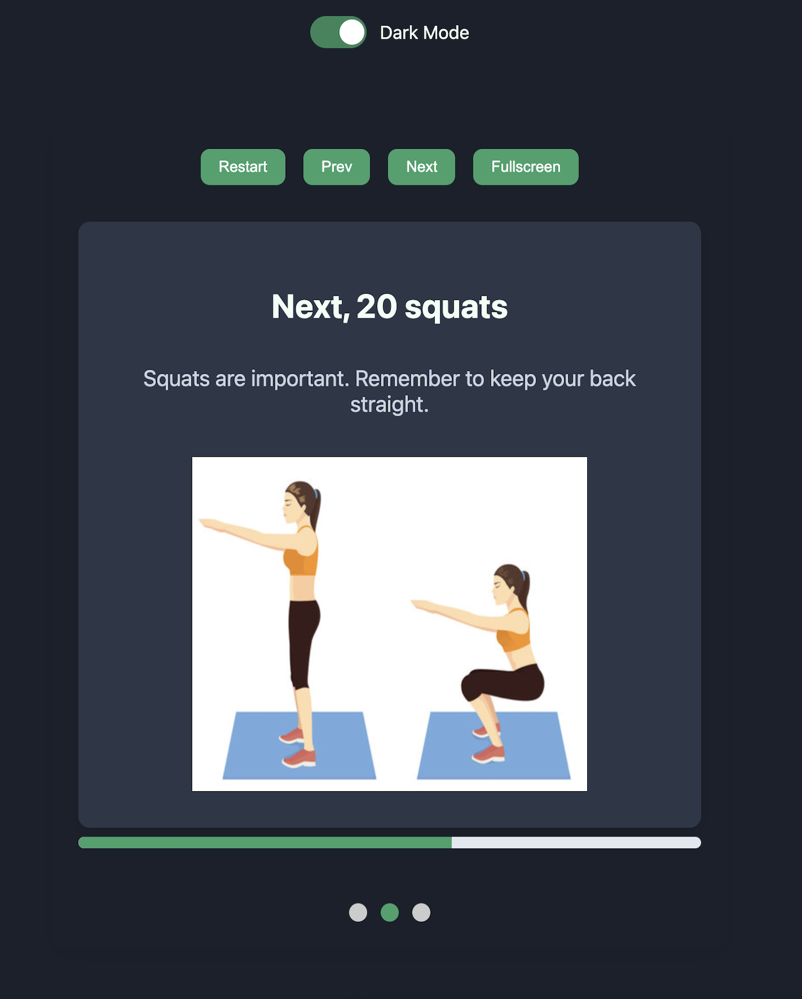

# Workout Slides App

A simple React-based presentation tool that guides users through a basic workout routine with clear instructions and images.

---

## Overview

This app presents a step-by-step workout plan in the form of slides. Each slide displays an exercise with helpful text and an image (if applicable), making it easy to follow along and maintain proper form.

---

🔗 **Live Demo**:
[Click here to view the deployed app](https://your-vercel-app-url.vercel.app)

## Features

1. **Keyboard Navigation**
   Users can navigate slides using the left/right arrow keys (← for previous, → for next) and press **"R"** to restart the presentation.

2. **Save Current Slide to localStorage**
   The current slide is persisted in `localStorage` so that users resume at the same slide even after a page reload.

3. **Swipe Gestures for Mobile**
   Touch-enabled devices support swipe left/right gestures for intuitive slide navigation.

4. **Better Accessibility**

   - ARIA roles and labels (e.g., `aria-live`, `role="region"`) help screen readers identify the slide content.
   - Buttons are keyboard-focusable with visible focus styles for enhanced usability.

5. **Customizable Slide Content**
   Slides support customizable content, including images, titles, and text to tailor each slide for your needs.

6. **Dot Navigation**
   Small navigation dots represent each slide, allowing users to jump directly to any slide.

7. **Fullscreen Mode**
   Toggle fullscreen mode for a distraction-free and immersive presentation experience.

8. **Dark Mode Auto-detect**
   The app automatically switches to dark mode on systems where `prefers-color-scheme: dark` is set.

## Screenshots

### Desktop View (Light Mode)


### Mobile View (Light Mode)


### Desktop View (Dark Mode)



### Mobile View (Dark Mode)


## Installation

1. **Clone the repository:**

   ```bash
   git clone https://github.com/maria-an11/slides-app.git
   cd slides-app
   ```

2. **Install dependencies:**

   ```bash
   npm install
   ```

   or with Yarn:

   ```bash
   yarn install
   ```

3. **Start the development server:**

   ```bash
   npm start
   ```

   or with Yarn:

   ```bash
   yarn start
   ```

The app should now be running at [http://localhost:3000](http://localhost:3000).

## Build & Deployment

To create a production build, run:

```bash
npm run build
```

or with Yarn:

```bash
yarn build
```

You can then deploy the contents of the `build/` directory to your favorite hosting service (e.g., Vercel, Netlify, GitHub Pages).

## Folder Structure

```
your-project/
├── public/
│   └── index.html
├── src/
│   ├── components/
│   │   ├── Slides.js
│   │   ├── Slides.css
│   │   ├── Navigation/
│   │   │   ├── Navigation.jsx
│   │   │   └── Navigation.css
│   │   ├── ProgressBar/
│   │   │   ├── ProgressBar.jsx
│   │   │   └── ProgressBar.css
│   │   ├── Dots/
│   │   │   ├── Dots.jsx
│   │   │   └── Dots.css
│   │   └── SlideCard/
│   │       ├── SlideCard.jsx
│   │       └── SlideCard.css
│   ├── hooks/
│   │   ├── useSwipeNavigation.js
│   │   ├── useFullscreen.js
│   │   └── useKeyboardNavigation.js
│   ├── data/
│   │   └── slidesData.js
│   ├── App.jsx
│   ├── App.css
│   └── index.js
├── .gitignore
├── package.json
└── README.md
```

## License

This project is licensed under the [MIT License](LICENSE).
